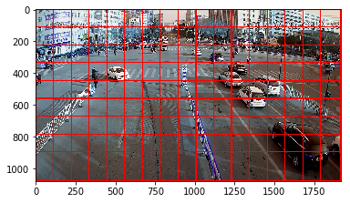

# torchdet

## split image to detect small object
- remove bounding box on the boundary for each small image
- each small image >= 2x2 grid = target image size



## reference
- https://github.com/eriklindernoren/PyTorch-YOLOv3
- https://github.com/ultralytics/yolov3
```
source activate pytorch1.0
cd ~/git/gnu/code/yolov3
python detect.py --cfg yolov3.cfg --weights yolov3.weights --images dataset/demo
```
- https://github.com/facebookresearch/Detectron